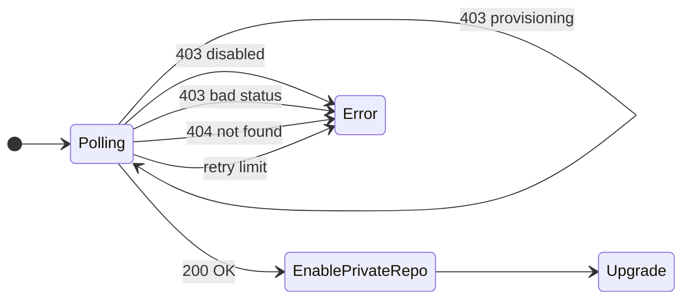

# Phase 2 — DP Token Retrieval FSM

> Source: [`p2-dpmp-fsm.py`](./p2-dpmp-fsm.py) + [MP Design (Confluence)](https://netskope.atlassian.net/wiki/spaces/~712020c343a84a23ba4748836f1eec3d7d3702/pages/7719321601/Secure+Private+Artifact+Repository+-+MP+Design#External-Service-Endpoints-(for-Wizards))

## Response Behaviour

| HTTP Response | Error Message | DP Behaviour | MP Token State |
|---|---|---|---|
| `200` | — | `upgrade()` — enable private repo | `enabled` |
| `403` | `"disabled"` | terminal error | `disabled` (feature flag off) |
| `403` | `"refreshing"` | retry (transient) | `refreshing` (post-expiry window) |
| `403` | `"provisioning"` | retry (transient) | `provisioning` (first-time create) |
| `403` | `<other>` | terminal error — unsupported state | unexpected |
| `404` / else | `"no token exists"` | terminal error — token not found | no non-terminal record in DB |
